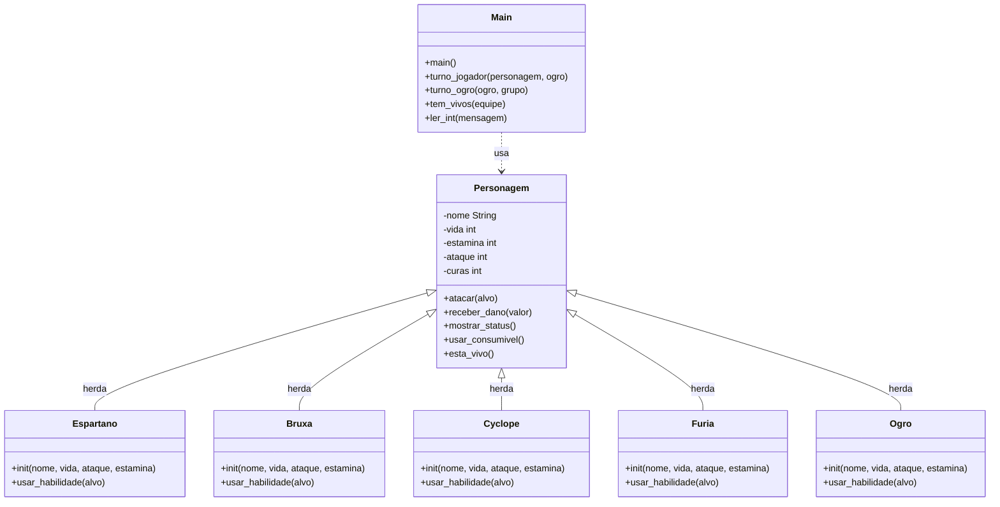

```mermaid
classDiagram
    class Personagem {
        -nome String
        -vida int
        -estamina int
        -ataque int
        -curas int
        +atacar(alvo)
        +receber_dano(valor)
        +mostrar_status()
        +usar_consumivel()
        +esta_vivo()
    }

    class Espartano {
        +init(nome, vida, ataque, estamina)
        +usar_habilidade(alvo)
    }

    class Bruxa {
        +init(nome, vida, ataque, estamina)
        +usar_habilidade(alvo)
    }

    class Cyclope {
        +init(nome, vida, ataque, estamina)
        +usar_habilidade(alvo)
    }

    class Furia {
        +init(nome, vida, ataque, estamina)
        +usar_habilidade(alvo)
    }

    class Ogro {
        +init(nome, vida, ataque, estamina)
        +usar_habilidade(alvo)
    }

    class Main {
        +main()
        +turno_jogador(personagem, ogro)
        +turno_ogro(ogro, grupo)
        +tem_vivos(equipe)
        +ler_int(mensagem)
    }

    Personagem <|-- Espartano : herda
    Personagem <|-- Bruxa : herda
    Personagem <|-- Cyclope : herda
    Personagem <|-- Furia : herda
    Personagem <|-- Ogro : herda
    Main ..> Personagem : usa
```
